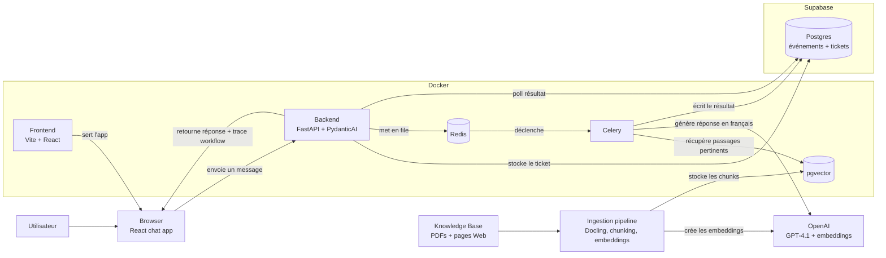
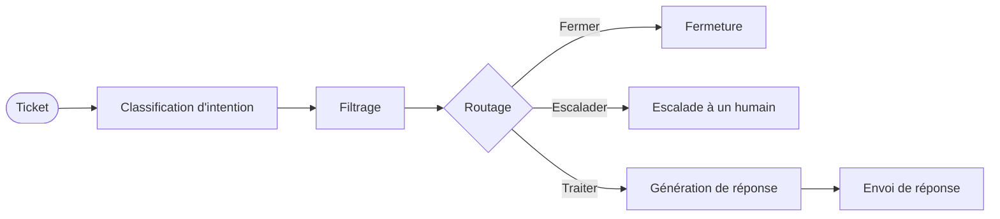
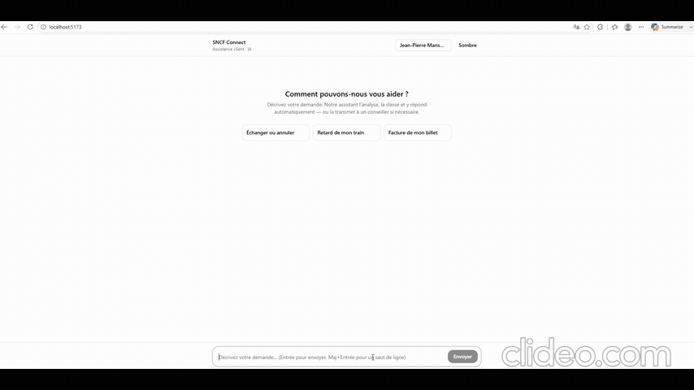
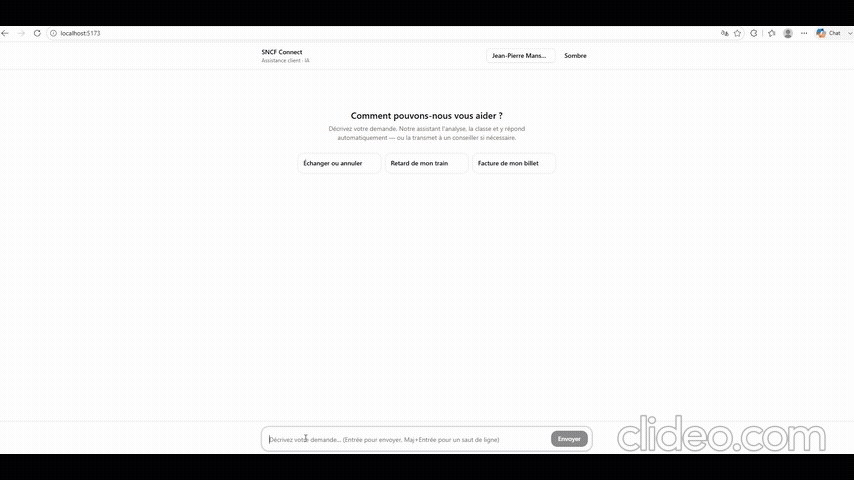
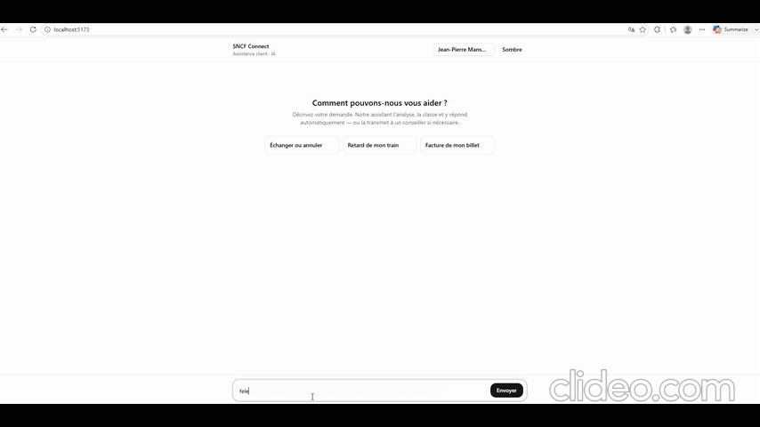
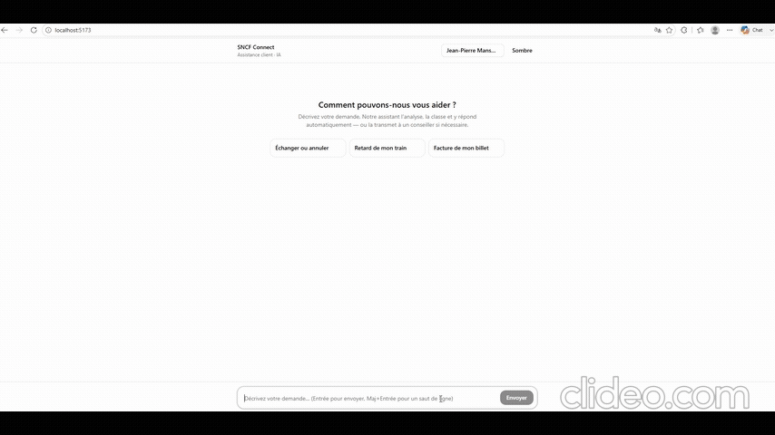

# Assistant IA pour le support client
**Présentation d'un prototype fonctionnel : système IA de traitement automatique des tickets client.**


## Contexte

Ce projet est un **P.O.C.** qui illustre le fonctionnement réel de la conception d'un workflow complet autour de la gestion automatisée des tickets clients, capable d'orchestrer intelligemment toute requête utilisateur issue de situations concrètes et réelles. Pour simuler des cas réels, le projet prend l'exemple de la **SNCF**, qui gère quotidiennement des demandes clients exhaustives, répétitives et complexes. Notre cas d'usage est donc particulièrement pertinent.

## Architecture

Le schéma ci-dessous illustre comment les différents composants de l'application interagissent :


<br>





<br>

<br>

L'architecture de l'application repose sur un stack *full-stack* (**backend** + **frontend**) dans lequel un workflow de nœuds agentiques de **PydanticAI** est orchestré côté backend, tandis que le frontend a pour objectif d'illustrer simplement ce workflow en action à travers un chat UI. Concrètement, des tickets sont envoyés à une API **FastAPI**, stockés dans **Supabase** (**PostgreSQL**), mis en file d'attente via **Redis**, puis traités de manière asynchrone par un worker **Celery**.

## Workflow

Les demandes soumises via le chat sont envoyées à l'API, qui déclenche le workflow suivant :



### Étapes

**Réception**<br>
Le ticket arrive via **FastAPI** et est stocké en base (**Supabase**).

**Traitement asynchrone des tasks**<br>
Le ticket est mis en file d'attente dans une base de données intermédiaire (**Redis**), un **worker Celery** le récupère et lance le workflow de manière asynchrone.

**Analyse** *(3 sous-agents en parallèle)*
- **Classification d'intention** : L’IA (**PydanticAI** + **OpenAI**) détermine l’intention (ex: "conditions", "délais", "retard de train", "remboursement")

```python
system_prompt=(
    "You are a customer support agent for SNCF Connect. "
    "Read the customer message and tell us two things:\n"
    "1. What is the customer talking about: a general question, a product question, "
    "a billing issue, or a refund request.\n"
    "2. Does this need a human to handle it? Yes if the customer is clearly demanding "
    "something specific — a refund, a compensation, disputing a charge. "
    "No if they are just asking how something works.\n"
    "Always reply in French."
)
```

- **Détection de spam** : vérifie que le message provient d'un vrai humain.
- **Filtrage** : Détection de spams
- **Routage** : Selon l’analyse, le ticket est fermé, escaladé à un humain, ou traité automatiquement.
- **Génération de réponse** : Si traitement automatique, l’IA génère une réponse pertinente via **RAG**, en se basant sur la base de vecteurs **pgvector**.
- **Envoi de réponse** : La réponse est envoyée au client ou le ticket est escaladé.


### Gains opérationnels

---

## Interface Chatbot IA

### Test du pipeline RAG

Testons le workflow face à de vraies questions utilisateurs. Le principe est simple : 
choisir une question dont la réponse figure dans la base de connaissances, et observer 
ce que le pipeline RAG retourne.

Par exemple :

```python
question_utilisateur = "Puis-je voyager avec mon chien dans le TGV ?"
```

```python
question_utilisateur = "Un enfant de 3 ans a-t-il besoin d'un ticket ?"
```



<br>

Testons ensuite sur une question plus délicate :

```python
question_utilisateur = "Mon train avait 1h30 de retard, ai-je droit à une compensation ?"
```



### Résultat

Les réponses sont parfaitement pertinentes, et les chunks sélectionnés correspondent
bien aux paragraphes identifiés au préalable dans chaque source.

Les tests RAG étant concluants, testons à présent un message spam, puis un message
nécessitant une intervention humaine :

```python
question_utilisateur = "Félicitations, vous avez remporté un iPhone !"
```



```python
question_utilisateur = "Je voudrais un remboursement immédiatement !"
```



### Résultat

Les deux messages ont correctement été classifiés.

## Conclusion

Ce prototype démontre qu'il est possible d'automatiser intelligemment le traitement des tickets clients : les questions courantes sont répondues via RAG, les spams filtrés, et les cas sensibles escaladés à un humain.

En pratique, cela réduit significativement la charge répétitive des équipes support, tout en gardant un humain dans la boucle là où c'est nécessaire.
